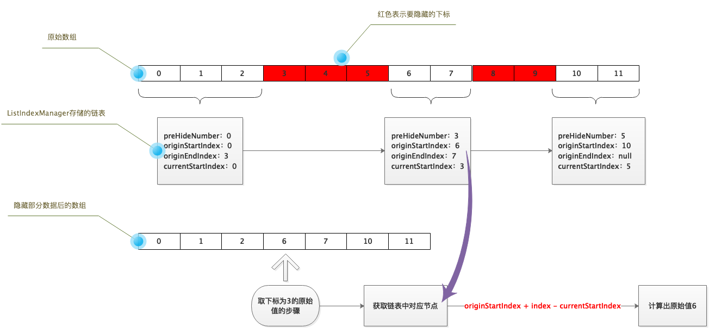

[dart pub](https://pub.dev/packages/list_index_manager)
# list_index_manager

显示列表数据的时候经常会遇到是需要隐藏部分数据的情况，list_index_manager可以将隐藏部分数据后的数组下标转换成原始数据下标。



## 用法

```
List<Info> dataList = [];
ListIndexManager manager = ListIndexManager();

ListView.builder(
        itemCount: dataList.length - manager.totalHideNumber,
        itemBuilder: (_, index) {
          Info info = dataList[manager.indexOf(index)];
          ...
        },
      )
```
### 隐藏数据
```
//隐藏dataList中index下标数据
manager.hide(index);
//隐藏dataList中下标从start到end的数据
manager.hideRange(start,end);
```

### 显示数据
```
//隐藏dataList中index下标数据
manager.show(index);
//隐藏dataList中下标从start到end的数据
manager.showRange(start,end);
```

### 清除所有设置
```
manager.clear();
```
